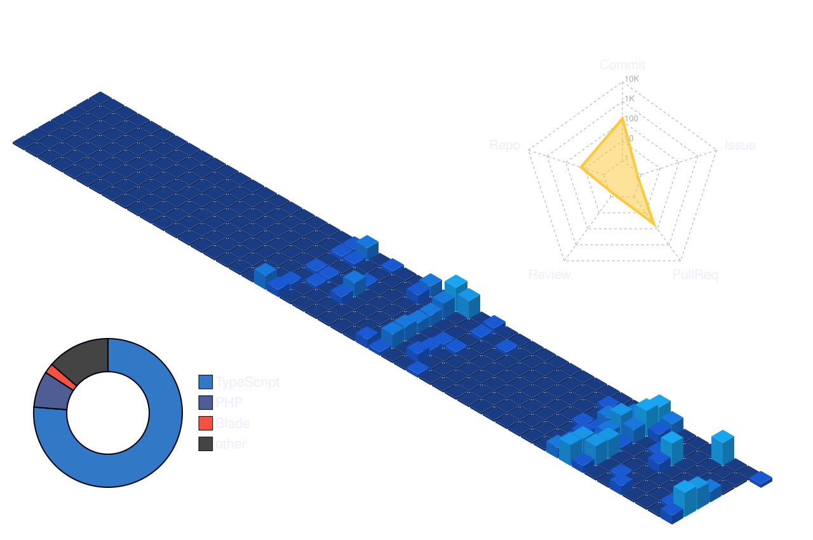

# Hi there, I'm Ryo 👋
### Full-Stack Developer • 3D Web Enthusiast • AI Agent Builder
    

    

    

    
---

<!-- quote-start -->

>  *"If you do not like your destiny, do not accept it. Instead, have the courage to change it."* — **Naruto Uzumaki**

<!-- quote-end -->

---
    
###  About Me
    
-  Working on interactive 3D AI web experiments & **Full-Stack apps**.
-  Exploring **Three.js, MMD parsing, React 19, and Voice/AI pipelines**.
-  Passionate about blending anime/virtual aesthetic with modern web technologies.
-  Ask me about **TypeScript, Laravel, React, or Vite setups**.
    
---
    
###  Tech Stack & Tools
    

    
 

    

    
---
    
###  Featured Projects
    
| Project | Description | Stack |
| :--- | :--- | :--- |
| **[Viera-AI](https://github.com/nescryo/Viera-AI)** | Interactive 3D avatar & AI system on the web | `React` `Three.js` `TypeScript` |

    
---
    
###  GitHub Stats
    

    
    
 

  

